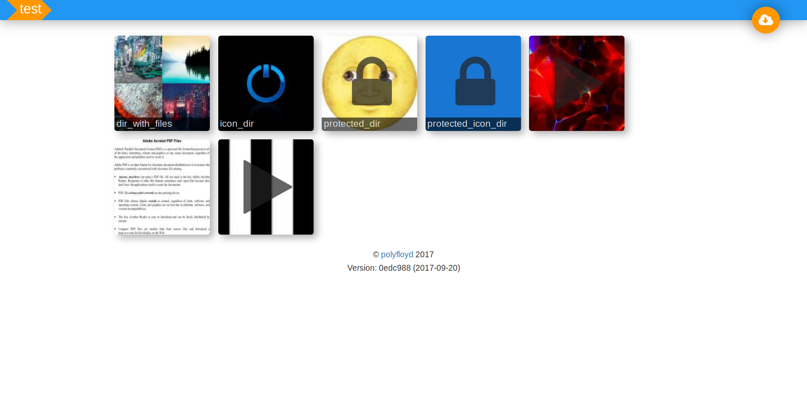
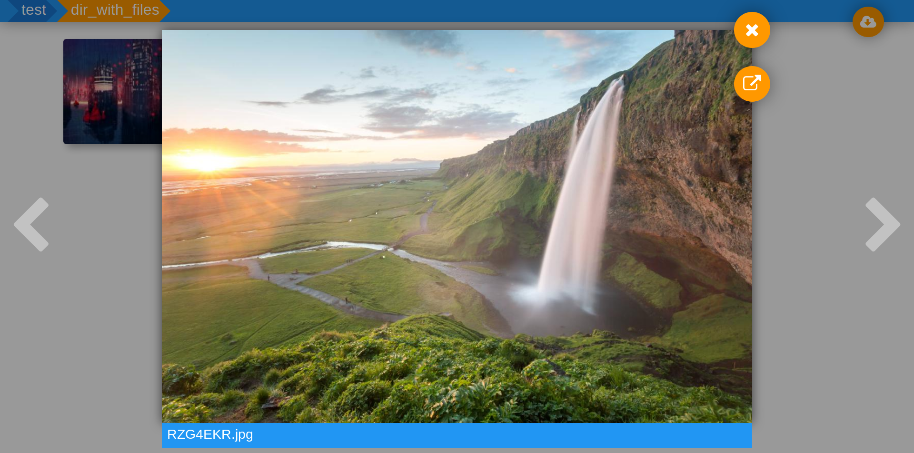

webfs
=====

A daemon that presents the contents of one or more directories through a
web-interface.


## Configuring
```
Usage of webfs:
  -cache-dir string
      The directory to store generated thumbnails. If empty, all files are kept in memory (default "/tmp/webfs-1000")
  -listen string
      The HTTP root of a Piwik installation, must not end with a slash (default "localhost:8080")
  -mount string
      The root directory to expose (default ".")
  -nopasswd
      Globally disable passord protection (debug builds only)
  -piwik-root string
      The HTTP root of a Piwik installation, must not end with a slash
  -piwik-site int
      The Piwik Site ID
  -pregen-thumbs
      Generate thumbnails for every file in all configured filesystems on startup
  -urlroot string
      The HTTP root, must not end with a slash
```

Some thumbnail processors require an external program to function:
* Vector images (e.g. svg and pdf) require Inkscape
* Videos require ffmpeg

### Special Files
It's important to note that dotfiles (filenames starting with `.`) are hidden.

### .passwd.txt
Create a file called `.passwd.txt` in a directory that you would like to
protect. All underlying files will require a username and password to be
accessible.

The format of the file requires a username and password separated by a single
space. It is possible to specify multiple username/password pairs on separate
lines.

Example:
```
tarzan correcthorsebatterystaple
jane mysecretpassword
```

### .icon.(png|jpe?g)
By default, the thumbnail of a directory will be based on its contents. If
you'd like to set a custom thumbnail, name an image file accordingly.


## Screenshots


